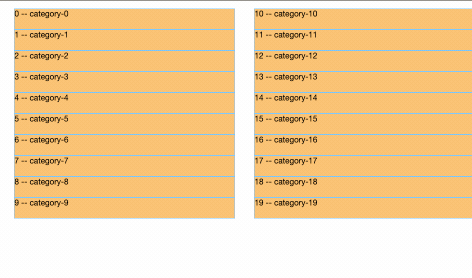
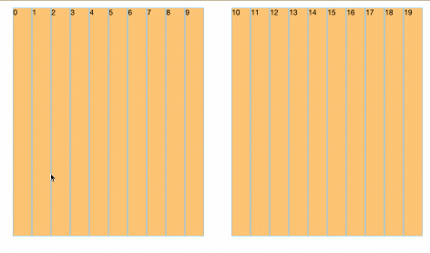
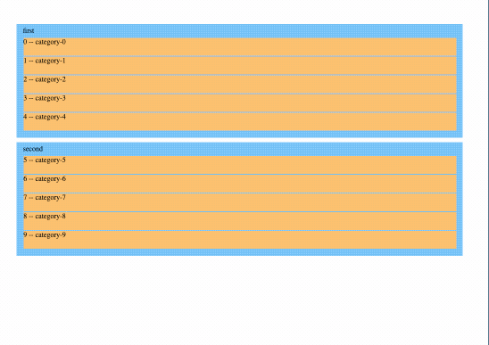

# nest-dnd

_A dnd library for React/VanillaJS, Maybe Vue/Svelet_

## How to start

```bash
$ yarn install
$ yarn storybook
```

## How to publish 

```bash
$ lerna publish
```

## Basic examples

### Vertical



### Horizontal



### Nested Group


